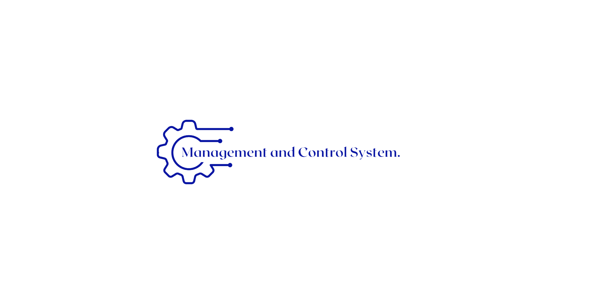
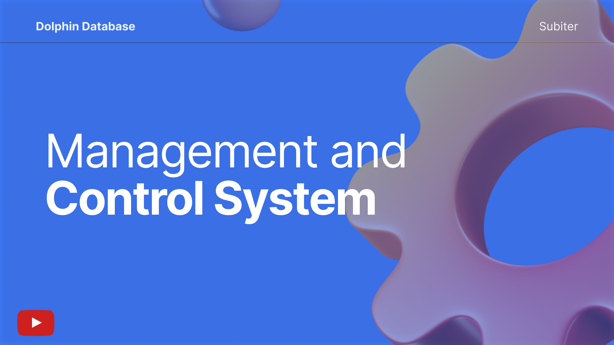

<p align="center">
  
</p>


## Tabela de Conteúdos

 * [Descrição](#descrição)
 * [Documentação](#documentação)
 * [Pré-requisitos e como executar a aplicação](#pré-requisitos-e-como-executar-a-aplicação)
 * [Funcionalidades desenvolvidas](#funcionalidades-desenvolvidas)
 * [Ilustração das funcionalidades](#ilustração-das-funcionalidades)
 * [Demonstração](#demonstração)
 * [Manual do Usuário](#manual-do-usuário)
 * [Backlog do Produto](#backlog-do-produto)  
 * [Roadmap](#roadmap)
 * [Gráfico de Burndown](#gráfico-de-burndown)
 * [Cronograma do API](#cronograma-do-api)
 * [Tecnologias](#tecnologias)
 * [Team](#team)
 * [Licença](#licença)

## Descrição

<p align="justify">
A MCS (Management and Control System) é um sistema ERP que visa gerenciar e controlar dados, afim de reduzir custos, facilitar tomadas de decisão, otimizar o tempo de atendimento de chamados e aprimorar o solucionamento destes. 
É composta por níveis de usuários, onde o administrador terá controle sobre todas as funcionalidades existentes, dentre elas o cadastro, edição e exclusão de outros usuários; o cliente trará o problema para o suporte e, este ficará responsável por gerenciar chamados e resolvê-los.
<br/>
Sua interface web facilita a gestão de dados e dá autonomia aos usuários dessa aplicação para que possam atuar com desenvoltura dentro das permissões concedidas.

## Documentação

 Para acessar a documentação completa do projeto, clique [aqui](Documentação/SPRINT1/Documentacao_MCS.pdf).

## Pré-requisitos e como executar a aplicação

<details><summary>Pré-requisitos</summary>
 
* Instalação [Java](https://docs.oracle.com/en/java/javase/11/install/installation-jdk-microsoft-windows-platforms.html#GUID-E3C75F92-D3B2-421D-A9BE-933C15F7CD1B)
* IDE - sugestão [Eclipse](https://www.eclipse.org/downloads/) 

</details>

<details><summary>Back-end</summary>

```bash 
# via PowerShell
$ git clone https://github.com/DolphinDatabase/MCS/tree/main

cd backend
mvn clean install
mvn spring-boot:run
cd ..
```
</details>

<details><summary>Front-end</summary>
  
```bash
# via PowerShell

cd frontend
yarn install
yarn dev
```

</details>

Com os pré-requisitos prontos,
*acesse no navegador o endereço:
http://localhost:5173*

**IMPORTANTE:**

*E-mail:* adm@email.com
 
*Senha:* 123456

 
Para acessar o manual do usuário, clique [aqui](Manual/ManualUsuario_MCS.pdf).

## Funcionalidades desenvolvidas

- [X] Cadastro de Usuários
- [X] Visualização de Usuários
- [X] Edição de Usuários
- [X] Exclusão de Usuários
- [X] Criação de Chamados
- [X] Adição de Problemas
- [X] Adição de Soluções
- [X] Identificação de Soluções
- [X] Gerar Orçamentos
- [X] Criar Relatórios


 Para mais informações das funcionalidades entregues, acesse as [releases](https://github.com/DolphinDatabase/MCS/releases/tag/Sprint1).

## Ilustração das Funcionalidades

Para acessar nossos *Wireframes*, clique [aqui](https://www.figma.com/file/OL07HIxLkiXBkHdiCrxey5/MCS?node-id=0%3A1).

## Demonstração

Para acessar o vídeo[^1] de demonstração da aplicação em uso, clique [aqui](https://youtu.be/omSyXxA3AYI):

[](https://youtu.be/omSyXxA3AYI "MCS vídeo Demonstração")

## Manual do Usuário

 Para acessar o manual do usuário, clique [aqui](Manual/ManualUsuario_MCS.pdf).

## Backlog do Produto

- [X]  **SPRINT 1:**  Base da ferrramenta
- [X]  Cadastro de usuários
- [X]  Edição de usuários
- [X]  Exclusão de usuários
- [X]  Visualização de usuários
- [X]  Chamados
- [X]  Problemas do Chamado
- [X]  Gerenciamento do orçamento
- [X]  Soluções
- [X]  Relatório
- [ ]  **SPRINT 2:**  Análises
- [ ]  Melhorias no Orçamento
- [ ]  Edição de problemas
- [ ]  Exclusão de soluções
- [ ]  Gerenciamento de estoque
- [ ]  Agendamento de serviços
- [ ]  Análise de falhas
- [ ]  Análise de chamados

## Roadmap

Para acessar nosso *Roadmap*, clique [aqui](https://dolphin-database.atlassian.net/jira/software/projects/MCS/boards/4/roadmap?shared=&atlOrigin=eyJpIjoiZmEyMzdjZDQyYmVjNDY4MDkzNTU4MjMxNmMxMzQyYTUiLCJwIjoiaiJ9)

## Gráfico de Burndown

Para acessar nosso *Burndown*, clique [aqui](https://dolphin-database.atlassian.net/jira/software/projects/MCS/boards/4/reports/burndown)

## Cronograma do API
 
| Data | Evento |
| -------| --------- |
| 15/08 a 19/08 | Kick-off. |
| 28/08 a 18/09 | [Sprint 1](Sprints/SPRINT1.md). |
| 19/09 a 09/10 | [Sprint 2](#). |
| 13/10 a 06/11 | [Sprint 3](#). |
| 07/11 a 27/11 | [Sprint 4](#). |
| 08/12 às 19h | Feira de Soluções. |

## Tecnologias

<details><summary>Organização e Comunicação</summary>
  
<a href="https://dolphin-database.atlassian.net/jira/software/projects/MCS/boards/4/backlog" target="_blank"> </a>
<a href="https://slack.com/intl/pt-br/" target="_blank"></a>
<a href="https://www.notion.so/pt-br" target="_blank"></a><br/>
<a href="https://www.figma.com" target="_blank">
</a><br/>
  
</details>

<details><summary>Linguagens</summary>

<a href="https://www.java.com/pt-BR/download/help/java8_pt-br.html" target="_blank"></a>

<br/>

<a href="https://www.javascript.com" target="_blank"></a>

</details>

<details><summary>Framework</summary>

<a href="https://element-plus.org/en-US/" target="_blank"></a>
<a href="https://br.vuejs.org/" target="_blank"></a>
<a href="https://spring.io/projects/spring-boot" target="_blank"></a>

</details>


<details><summary>SGBD</summary>

<a href="https://www.oracle.com/br/downloads/"></a>

</details>

<details><summary>Plataforma</summary>

<a href="https://www.docker.com"></a>

</details>


## Team

<a href="https://github.com/beamedeiros" target="_blank"></a>
<a href="https://github.com/pdrMottaS" target="_blank"></a>
<a href="https://github.com/Borgarelli" target="_blank"></a>
 <br/>
<br></br>
Para mais informações[^2], clique [aqui](https://github.com/DolphinDatabase/MCS/wiki/Development-Team).

## Licença  

Este projeto esta sob licença [MIT](LICENSE).<br/>

[^1]: Vídeo produzido e editado pelos integrantes do grupo.
[^2]: Equipe responsável pelo desenvolvimento do Projeto Integrador.
